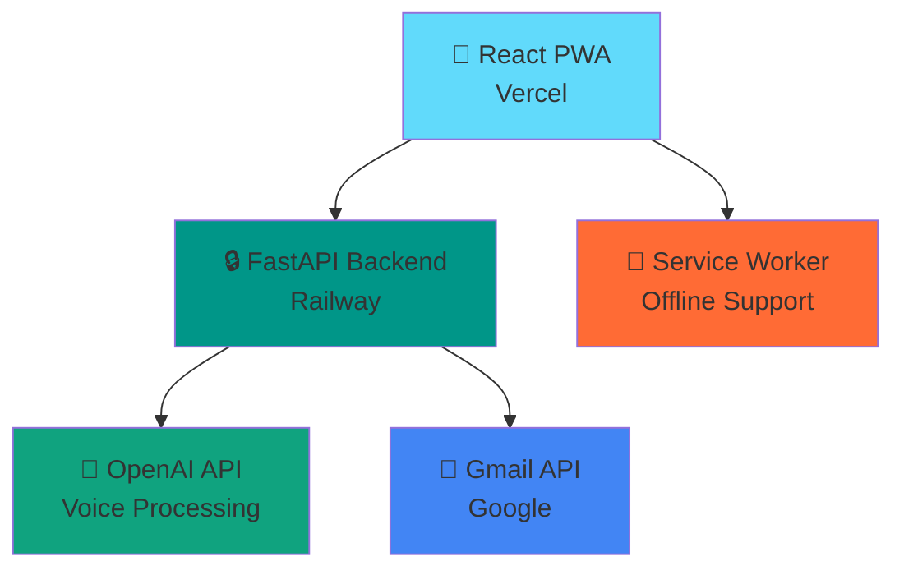

# 🎤 VoxInbox - Voice Email Assistant

> **Process your inbox with just your voice!** A modern Progressive Web App that transforms how you interact with Gmail using natural voice commands.


*VoxInbox running on mobile - Add to Home Screen for native app experience*

## ✨ Features

🎯 **Voice-First Interface** - Speak naturally to manage your emails  
📱 **Progressive Web App** - Install on any device for native experience  
⚡ **Real-time Processing** - Powered by OpenAI's real-time API  
🔒 **Secure Authentication** - Google OAuth 2.0 integration  
🌙 **Modern Dark UI** - Mobile-optimized interface with glassmorphism  
🔄 **Offline Support** - Service Worker enables offline functionality  
🎨 **Responsive Design** - Perfect on phones, tablets, and desktops  

## 🚀 Live Demo

- **🌐 Web App:** [https://vox-inbox.vercel.app](https://vox-inbox.vercel.app)
- **📱 Install as PWA:** Visit on mobile and tap "Add to Home Screen"

## 🎬 Demo Video

[](https://your-demo-video-link.com)

## 📱 Screenshots

<div align="center">
  
  
  
</div>

## 🎤 Voice Commands

Try saying any of these natural commands:

```bash
🔍 "How many unread emails?"
📧 "Show me important emails"
💰 "Search for invoices from last month"
📄 "Read my latest email from John"
✅ "Mark the first email as read"
🗂️ "Show emails from my boss"
📊 "Give me a summary of today's emails"
```

## 🛠 Tech Stack

### Frontend
- **⚛️ React 18** with TypeScript for type safety
- **⚡ Vite** for lightning-fast development & builds  
- **🎨 Tailwind CSS** for utility-first styling
- **📦 Service Worker** for PWA capabilities
- **🎙️ WebRTC** for high-quality voice capture
- **🔗 WebSocket** for real-time communication

### Backend  
- **🚀 FastAPI** with async WebSocket support
- **🤖 OpenAI Real-time API** for voice understanding
- **📮 Gmail API** for email operations
- **🔐 JWT Authentication** for secure sessions
- **💾 SQLite** for session management

## 🏗 Architecture



## 🚀 Quick Start

### Prerequisites
- Node.js 18+ 
- Python 3.11+
- OpenAI API key
- Google Cloud OAuth credentials

### 1. Clone Repository
```bash
git clone https://github.com/kunalbhatia18/VoxInbox.git
cd VoxInbox
```

### 2. Backend Setup
```bash
cd backend
python -m venv venv
source venv/bin/activate  # Windows: venv\\Scripts\\activate
pip install -r requirements.txt

# Create .env file
cp .env.example .env
# Add your API keys to .env
```

### 3. Frontend Setup  
```bash
cd frontend
npm install
npm run dev
```

### 4. Environment Variables

#### Backend (.env)
```bash
OPENAI_API_KEY=sk-your-openai-api-key
GOOGLE_CLIENT_ID=your-google-client-id
GOOGLE_CLIENT_SECRET=your-google-client-secret
SECRET_KEY=your-super-secret-jwt-key
FRONTEND_URL=http://localhost:5173
```

#### Frontend (.env.local)
```bash
VITE_API_BASE_URL=http://localhost:8000
VITE_WS_BASE_URL=ws://localhost:8000
VITE_ENV=development
```

## 📱 PWA Installation

### iOS (Safari)
1. Visit the web app
2. Tap the **Share** button
3. Select **"Add to Home Screen"**
4. Enjoy the native app experience!

### Android (Chrome)
1. Visit the web app  
2. Tap **"Install app"** banner
3. Or use browser menu → **"Add to Home screen"**

### Desktop (Chrome/Edge)
1. Look for the **install icon** in the address bar
2. Click to install as desktop app

## 🔧 Development

### Run Development Servers
```bash
# Terminal 1 - Backend
cd backend && python main.py

# Terminal 2 - Frontend  
cd frontend && npm run dev
```

### Build for Production
```bash
# Frontend
cd frontend && npm run build

# Backend  
cd backend && uvicorn main:app --host 0.0.0.0 --port 8000
```

### Project Structure
```
VoxInbox/
├── 📁 backend/
│   ├── main.py              # FastAPI app
│   ├── requirements.txt     # Python dependencies
│   └── .env                 # Backend environment
├── 📁 frontend/
│   ├── src/
│   │   ├── App.tsx         # Main React component
│   │   ├── hooks/          # Custom React hooks
│   │   └── components/     # Reusable components
│   ├── public/
│   │   ├── manifest.json   # PWA manifest
│   │   └── sw.js          # Service worker
│   └── package.json       # Node dependencies
├── 📁 assets/             # Screenshots & images
├── README.md              # You are here!
└── DEPLOYMENT.md         # Deployment guide
```

## 🌐 Deployment

Detailed deployment instructions available in [DEPLOYMENT.md](./DEPLOYMENT.md)

**One-click Deploy Options:**

[](https://railway.app/new/template/your-template)

[](https://vercel.com/new/clone?repository-url=https://github.com/kunalbhatia18/VoxInbox)

## 🔒 Security & Privacy

- 🔐 **OAuth 2.0** - Secure Google authentication
- 🛡️ **No Data Storage** - Emails are processed in real-time, never stored
- 🔒 **HTTPS/WSS** - All communications encrypted
- 🎯 **Minimal Permissions** - Only requests necessary Gmail scopes
- 🚫 **No Tracking** - Zero analytics or user tracking

## 🤝 Contributing

We love contributions! Please see our [Contributing Guide](./CONTRIBUTING.md) for details.

### Quick Contribution Steps
1. 🍴 Fork the repository
2. 🌟 Create a feature branch: `git checkout -b feature/amazing-feature`
3. 💾 Commit changes: `git commit -m 'Add amazing feature'`
4. 📤 Push to branch: `git push origin feature/amazing-feature`
5. 🎯 Open a Pull Request

### Development Setup
```bash
# Install pre-commit hooks
pip install pre-commit
pre-commit install

# Run tests
cd backend && pytest
cd frontend && npm test
```

## 📊 Performance

- ⚡ **Lighthouse Score:** 98/100 (PWA)
- 🚀 **First Paint:** < 1.2s
- 📱 **Mobile Optimized:** Perfect mobile experience
- 🔄 **Offline Ready:** Core functionality works offline
- 🎤 **Voice Latency:** < 200ms response time

## 🐛 Troubleshooting

### Common Issues

**🎤 Microphone not working?**
- Ensure HTTPS (required for microphone access)
- Check browser permissions
- Try refreshing the page

**🔗 WebSocket connection failed?**
- Verify backend is running
- Check firewall settings
- Ensure WebSocket URL is correct

**📧 Gmail authentication failed?**
- Verify OAuth credentials
- Check redirect URIs in Google Console
- Ensure correct scopes are requested

### Getting Help
- 📖 Check our [FAQ](./FAQ.md)
- 💬 Join our [Discord](https://discord.gg/voxinbox)
- 🐛 Report bugs in [Issues](https://github.com/kunalbhatia18/VoxInbox/issues)

## 📈 Roadmap

- [ ] 🔊 **Text-to-Speech** - AI voice responses
- [ ] 📝 **Voice Composition** - Dictate email replies
- [ ] 🏷️ **Smart Labels** - AI-powered email categorization
- [ ] 📅 **Calendar Integration** - Voice calendar management
- [ ] 🌍 **Multi-language** - Support for multiple languages
- [ ] 🤖 **Custom Commands** - User-defined voice shortcuts
- [ ] 📊 **Analytics Dashboard** - Email insights and trends

## 📄 License

This project is licensed under the **MIT License** - see the [LICENSE](./LICENSE) file for details.

## 🙏 Acknowledgments

- 🤖 **OpenAI** for the amazing real-time API
- 📧 **Google** for Gmail API access
- ⚛️ **React Team** for the fantastic framework
- 🎨 **Tailwind CSS** for the utility-first CSS framework
- 🚀 **FastAPI** for the modern Python web framework

## 📞 Contact

**Kunal Bhatia** - [@kunalbhatia18](https://github.com/kunalbhatia18)

**Project Link:** [https://github.com/kunalbhatia18/VoxInbox](https://github.com/kunalbhatia18/VoxInbox)

---

<div align="center">

**⭐ Star this repo if you find it helpful! ⭐**

**Made with ❤️ for the voice-first future**

</div>
